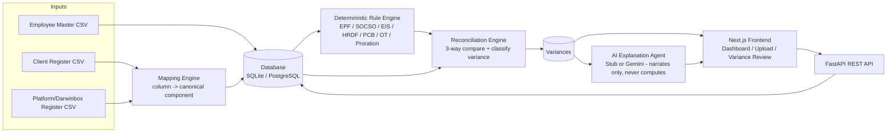

# PayVerify AI


AI-assisted payroll validation platform for Malaysia statutory compliance.

PayVerify AI performs a **three-way comparison** for every employee × pay component:

1. **Client Register** — the client's own payroll output (source of truth for "what was paid").
2. **Platform Register** — the payroll platform's output (e.g. Darwinbox export).
3. **Rule-Engine Expected Value** — a deterministic recomputation from first principles
   (EPF, SOCSO, EIS, HRDF, PCB, Overtime, Proration rules) that is 100% code-driven and
   auditable — no AI involved in the calculation itself.

Variances between these three values are classified deterministically (e.g. `rate_slab_mismatch`,
`amount_mismatch_beyond_tolerance`, `eligibility_mismatch`, `data_quality_issue`, ...). An AI layer
(Gemini, with a deterministic stub fallback) only **explains** an already-classified variance in
plain language and suggests a resolution — it never performs or overrides the actual calculation.

## Architecture



See [copilot-prompts/](copilot-prompts) for the phased DevOps plan (Docker → GitHub → CI/CD →
deployment → AI Gateway → monitoring → production readiness) and [docker/README.md](docker/README.md)
for the containerized architecture (adds PostgreSQL, Redis, and an Nginx reverse proxy).

## Repository layout

```
payverify-ai/
├── backend/                # FastAPI application (REST API, DB models, bootstrap)
│   └── app/
│       ├── main.py         # API entrypoint (routes, CORS)
│       ├── models.py       # Pydantic + SQLAlchemy models
│       └── database.py     # SQLite engine/session (backend/payverify.db)
├── rule-engine/             # Deterministic statutory calculators (EPF, SOCSO, EIS, HRDF, PCB, OT, proration)
├── validation-engine/       # Reconciliation + variance classification logic
├── services/                 # Mapping engine (column-name -> canonical component mapping)
├── agents/                   # AI explanation providers (StubExplanationProvider, GeminiExplanationProvider)
├── knowledge-base/            # Structured rule metadata / decision tables backing the rule engine
├── decision-tables/, decision-trees/, rules/, metadata/   # Supporting knowledge-engine artifacts
├── sample-data/               # Synthetic CSVs covering every variance type, for demos/tests
├── tests/                     # Pytest suite (59 tests) covering rule engine, mapping, reconciliation, API
├── docs/markdown/             # Source statutory documents (EPF/SOCSO/EIS acts) converted to markdown
├── frontend/                  # Next.js 16 + TypeScript + Tailwind UI
├── requirements.txt            # Python dependencies (pinned, from a known-working environment)
└── conftest.py                  # pytest sys.path bootstrap for hyphenated package dirs
```

## Prerequisites

- Python 3.11+ (a `.venv` is already set up in this repo at `payverify-ai/.venv`)
- Node.js 20+ and npm (for the frontend)

## Backend setup & run

```powershell
cd payverify-ai

# Create/activate the virtual environment (skip if .venv already exists)
python -m venv .venv
.venv\Scripts\Activate.ps1

# Install dependencies
.venv\Scripts\python.exe -m pip install -r requirements.txt

# Run the test suite
.venv\Scripts\python.exe -m pytest tests\ -q

# Start the API server (from payverify-ai/)
.venv\Scripts\python.exe -m uvicorn backend.app.main:app --reload --port 8000
```

The API will be available at `http://localhost:8000` (interactive docs at `http://localhost:8000/docs`).

### Environment variables (backend)

| Variable | Required | Purpose |
|---|---|---|
| `GEMINI_API_KEY` | No | If set, AI explanations use Gemini (`GeminiExplanationProvider`). If unset, a deterministic `StubExplanationProvider` generates rule-based explanation text — the app is fully functional without this key. |

Set it in your shell before starting uvicorn, or create a `.env` file in `payverify-ai/` (loaded via `python-dotenv`).

## Frontend setup & run

```powershell
cd payverify-ai\frontend
npm install
npm run dev
```

The UI will be available at `http://localhost:3000`. It expects the backend running at the URL
configured in `frontend/.env.local`:

```
NEXT_PUBLIC_API_BASE_URL=http://localhost:8000
```

For a production build:

```powershell
npm run build
npm run start
```

## Using the app

1. Open `http://localhost:3000` and click **+ New Project** to create a validation project
   (name, country = Malaysia, pay year/month).
2. On the project page, upload three files:
   - **Employee Master** CSV (id, dob, age, nationality, is_pr, elected_pre_1998, doj, doe,
     unpaid_leave_days, employment_type, is_director_fee_only)
   - **Client Register** CSV — mapping suggestions are shown for confirmation before upload
   - **Platform (Darwinbox) Register** CSV — same mapping confirmation flow
3. Click **Run Validation** to execute the rule engine + reconciliation engine across every
   employee/component combination.
4. Open the **Variance Dashboard** to review results, filter by classification, and drill into
   any row to see full detail, generate an AI explanation, and submit consultant feedback
   (confirmed / rejected / needs_correction), which updates the resolution status.
5. Visit **Rule Catalog** (`/rules`) to see every statutory rule implemented, its version,
   effective date, and source document for full traceability.

## Screenshots

> Screenshots are not yet committed to the repo. Once you have the app running (see above),
> capture the following and drop them into `docs/screenshots/` referencing them here:
> - `dashboard.png` — Projects Dashboard (`/`)
> - `upload-wizard.png` — Project detail / upload + mapping screen (`/projects/[id]`)
> - `variance-dashboard.png` — Variance Dashboard with classification filter
> - `variance-detail.png` — Variance drill-down with AI explanation + feedback form
> - `rule-catalog.png` — Rule Catalog (`/rules`)

## API documentation

Full interactive OpenAPI/Swagger docs are auto-generated by FastAPI at `/docs` (e.g.
`http://localhost:8000/docs`) whenever the backend is running. Summary of the main endpoints:

| Method | Path | Purpose |
|---|---|---|
| `POST` | `/api/projects` | Create a validation project |
| `GET` | `/api/projects` / `/api/projects/{id}` | List / get a project |
| `POST` | `/api/projects/{id}/employee-master` | Upload employee master CSV |
| `POST` | `/api/projects/{id}/registers/preview` | Preview column mapping suggestions for a register CSV |
| `POST` | `/api/projects/{id}/registers` | Upload + confirm-mapped client/platform register CSV |
| `POST` | `/api/projects/{id}/validate` | Run the rule engine + reconciliation engine |
| `GET` | `/api/projects/{id}/variances` | List variances (filterable by classification/resolution status) |
| `GET` | `/api/variances/{id}` | Get full variance detail |
| `POST` | `/api/variances/{id}/explain` | Generate/regenerate an AI explanation for a variance |
| `POST` | `/api/variances/{id}/feedback` | Submit consultant feedback (confirmed/rejected/needs_correction) |
| `GET` | `/api/rules` | List every implemented statutory rule (catalog/traceability) |
| `GET` | `/health` | Liveness check (used by Docker/Render health checks) |

## Troubleshooting

| Symptom | Likely cause | Fix |
|---|---|---|
| Frontend shows "API unreachable" on the Dashboard | Backend isn't running, or `NEXT_PUBLIC_API_BASE_URL` in `frontend/.env.local` doesn't match where uvicorn is listening | Start the backend (`uvicorn backend.app.main:app --port 8000`) and confirm the URL matches |
| CORS errors in the browser console | Frontend origin isn't in the backend's allowed origins | Set `CORS_ALLOWED_ORIGINS` (comma-separated) to include your frontend's exact origin |
| `ModuleNotFoundError` for `base`, `epf`, `reconciliation`, etc. | The flat-module `sys.path` bootstrap didn't run | Make sure `backend/app/main.py`'s `from . import bootstrap` import stays the first import, and that you're running from the `payverify-ai/` directory |
| Register upload rejects with a 413 (via Docker/Nginx) | Nginx's upload size limit | Already fixed — `client_max_body_size 20m;` is set in `docker/nginx/nginx.conf` |
| `psycopg` import/connection errors in Docker | `DATABASE_URL` malformed or Postgres not yet healthy | Check `docker compose ps` — backend should wait for `postgres: condition: service_healthy` before starting |
| AI explanation button does nothing / errors | `GEMINI_API_KEY` not set — this is fine, the stub provider should still respond | Check backend logs; if even the stub fails, it's likely an unrelated backend error, not a Gemini API issue |
| `npm run build` fails with a type error after editing a `[id]` route | Next.js 16 route `params` is a `Promise` | Unwrap it with `use()` from `react`, matching the existing pattern in `frontend/src/app/projects/[id]/page.tsx` |

## Testing

```powershell
cd payverify-ai
.venv\Scripts\python.exe -m pytest tests\ -q
```

59 tests currently cover the rule engine (EPF/SOCSO/EIS/HRDF/PCB/Overtime/Proration), the
mapping engine, the reconciliation/classification logic, and the FastAPI endpoints via
`TestClient`.

## Known limitations (MVP scope)

- EIS and PCB rules are placeholders pending SME validation (no authoritative source document
  was available at build time) — see `rule-engine/` and `docs/markdown/` for details.
- SOCSO category (1 vs 2) eligibility determination also needs SME sign-off (only the rate
  table is implemented).
- No authentication/authorization layer yet — this is a local/demo MVP, not production-hardened.
- `npm audit` reports vulnerabilities in transitive frontend dependencies (12 high, as of the
  last `npm install`) — acceptable for local MVP use but should be reviewed before any
  production deployment.

## Contributing

See [CONTRIBUTING.md](CONTRIBUTING.md) for branch strategy, commit conventions, and the PR
process. Security issues should be reported per [SECURITY.md](SECURITY.md), not as public issues.

## License

[MIT](LICENSE) — see the [LICENSE](LICENSE) file. See [CHANGELOG.md](CHANGELOG.md) for release history.
