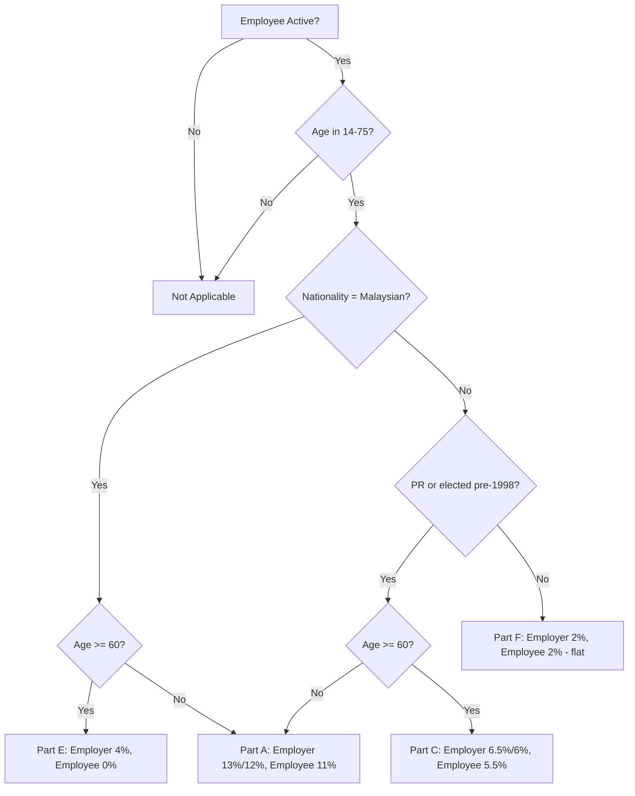
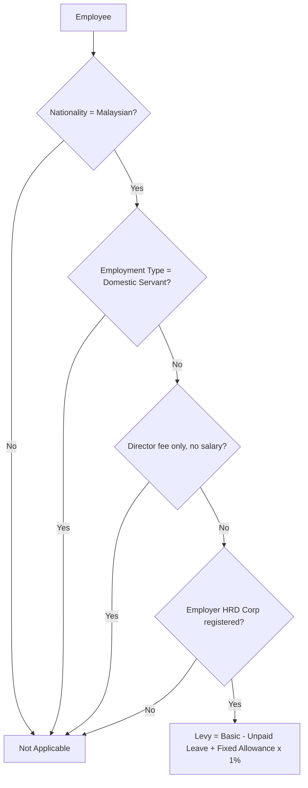
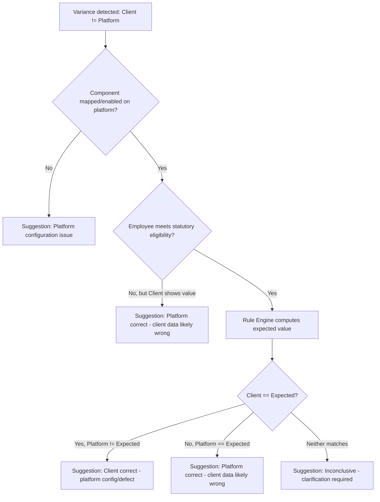

# Decision Trees — Malaysia

## EPF Eligibility & Rate Determination

```mermaid
flowchart TD
    A[Employee Active?] -->|No| Z[Not Applicable]
    A -->|Yes| B{Age in 14-75?}
    B -->|No| Z
    B -->|Yes| C{Nationality = Malaysian?}
    C -->|Yes| D{Age >= 60?}
    D -->|Yes| E[Part E: Employer 4%, Employee 0%]
    D -->|No| F[Part A: Employer 13%/12%, Employee 11%]
    C -->|No| G{PR or elected pre-1998?}
    G -->|Yes| H{Age >= 60?}
    H -->|Yes| I[Part C: Employer 6.5%/6%, Employee 5.5%]
    H -->|No| F
    G -->|No| J[Part F: Employer 2%, Employee 2% - flat]
```

## HRDF Eligibility

```mermaid
flowchart TD
    A[Employee] --> B{Nationality = Malaysian?}
    B -->|No| Z[Not Applicable]
    B -->|Yes| C{Employment Type = Domestic Servant?}
    C -->|Yes| Z
    C -->|No| D{Director fee only, no salary?}
    D -->|Yes| Z
    D -->|No| E{Employer HRD Corp registered?}
    E -->|No| Z
    E -->|Yes| F[Levy = Basic - Unpaid Leave + Fixed Allowance x 1%]
```

## Generalized Variance Diagnostic Pattern (BRD Section 8.3)

```mermaid
flowchart TD
    A[Variance detected: Client != Platform] --> B{Component mapped/enabled on platform?}
    B -->|No| S1[Suggestion: Platform configuration issue]
    B -->|Yes| C{Employee meets statutory eligibility?}
    C -->|No, but Client shows value| S2[Suggestion: Platform correct - client data likely wrong]
    C -->|Yes| D[Rule Engine computes expected value]
    D --> E{Client == Expected?}
    E -->|Yes, Platform != Expected| S3[Suggestion: Client correct - platform config/defect]
    E -->|No, Platform == Expected| S4[Suggestion: Platform correct - client data likely wrong]
    E -->|Neither matches| S5[Suggestion: Inconclusive - clarification required]
```
